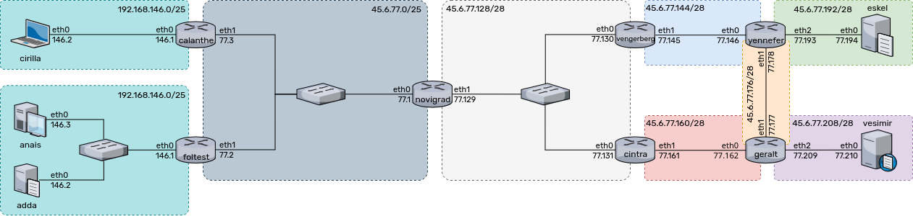

# Projet Internet 2023 - 2024

All machines have a hostname in The Witcher universe, and all the publicly accessible machines have a dns zone according this pattern : `{host}.witcher.n7`.

## How to run
```sh
./START
```
or
```sh
./STOP
```
## Architecture

